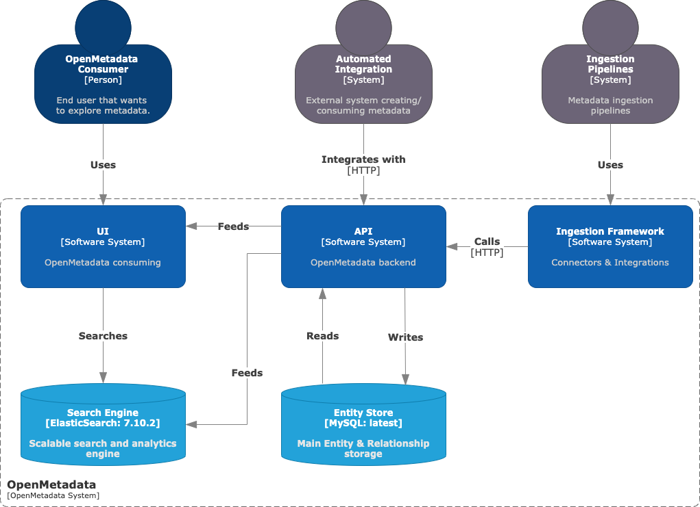

# gda2

## openmetadata exploration

### background

We are trying to see if we could use some of these open source products to compensate for short comings in AWS Data Zone and AWS Glue.
There are two layers we think this could be possible:
1. [Data Lineage](https://docs.open-metadata.org/v1.2.x/how-to-guides/openmetadata/data-lineage)
2. [Data Quality](https://docs.open-metadata.org/v1.2.x/how-to-guides/openmetadata/data-quality-profiler)

Openmetadata has the ability to generate lineage information from various inputs it ingests. These includes Metadata ingestion, pipeline ingestion and direct lineage ingestion. Openmetadata then make sense of all the lineage information from different sources and incorporate them into a coherent lineage diagram.

### testing
We are going to test how openmetadata can be integrated, or data lineage information can be either extracted.

### openmetadat high level design

based on the [hld](https://docs.open-metadata.org/v1.2.x/main-concepts/high-level-design), there are several areas we can target. 
hld is illustrated below:

We need to focus on the **API container** layer.

Apparently the API layer uses dropwizard as API server and are designed to respond to calls for CRUD operations. We should see how we can use these API as CRUD layer, and extract data. Only worry is the security piece.

### openmetadata apis

openmetadata api schema definition can be found [here](https://docs.open-metadata.org/v1.2.x/main-concepts/metadata-standard/apis).