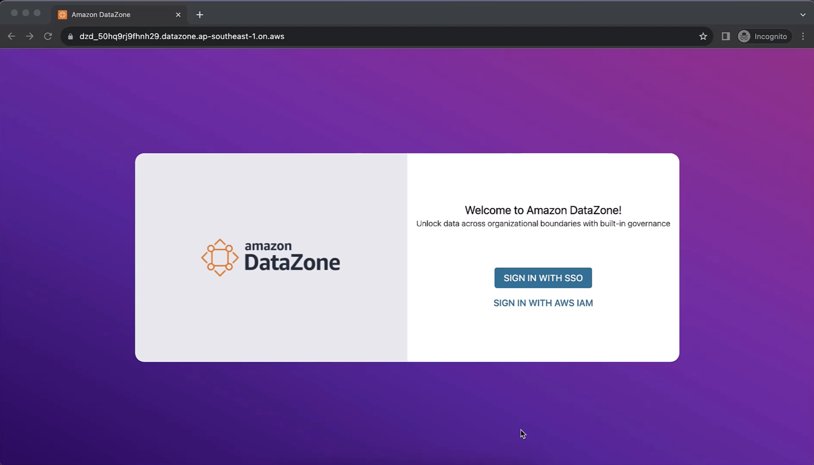

# datazone-demos
## Background
We built a mini demo environment for AWS Datazone for the SNDGO Data Infrastructure Workshop conducted on 1st Nov 2023.

## Setup

## Demo 

### Use Case #1 - Single Sign On using Azure AD Federation

### Use Case #2 - Data Publication and Consumption workflow - AWS

### Use Case #3 - Data Publication and Consumption workflow - Non AWS