# datazone-demos
## Background
We built a mini demo environment for AWS Datazone for the SNDGO Data Infrastructure Workshop conducted on 1st Nov 2023.

## Setup

## Demo 

### Use Case #1 - Single Sign On using Azure AD Federation

### Use Case #2 - Data Publication and Consumption workflow - AWS

[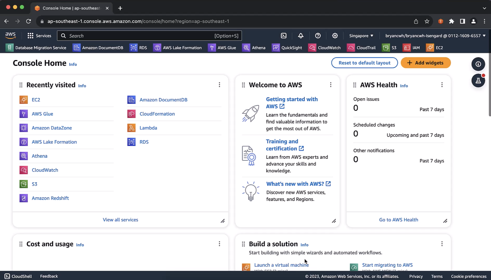]("https://dwei4f633mwy3.cloudfront.net/datazone-demo-part-2-1-28Nov2023")

[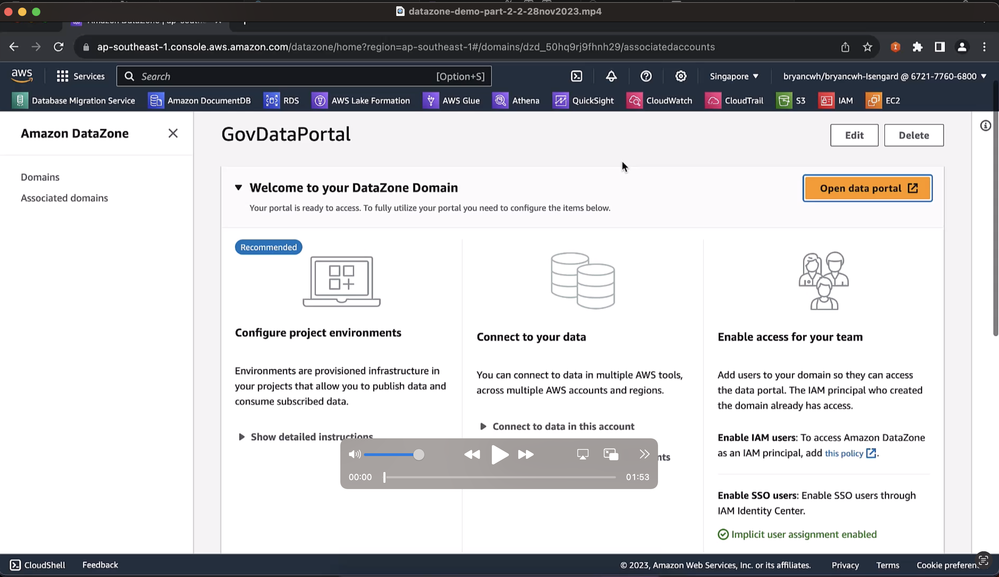]("https://dwei4f633mwy3.cloudfront.net/datazone-demo-part-2-2-28Nov2023.mp4")

### Use Case #3 - Data Publication and Consumption workflow - Non AWS

[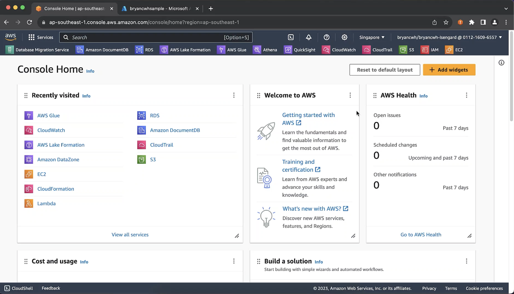]("https://dwei4f633mwy3.cloudfront.net/datazone-demo-part-4-1-28Nov2023")

In this section, we will demonstrate how to ingest metadata into AWS Data Zone from non-AWS sources. We are going to make use of AWS Glue to crawl a database within Azure SQL itself. 

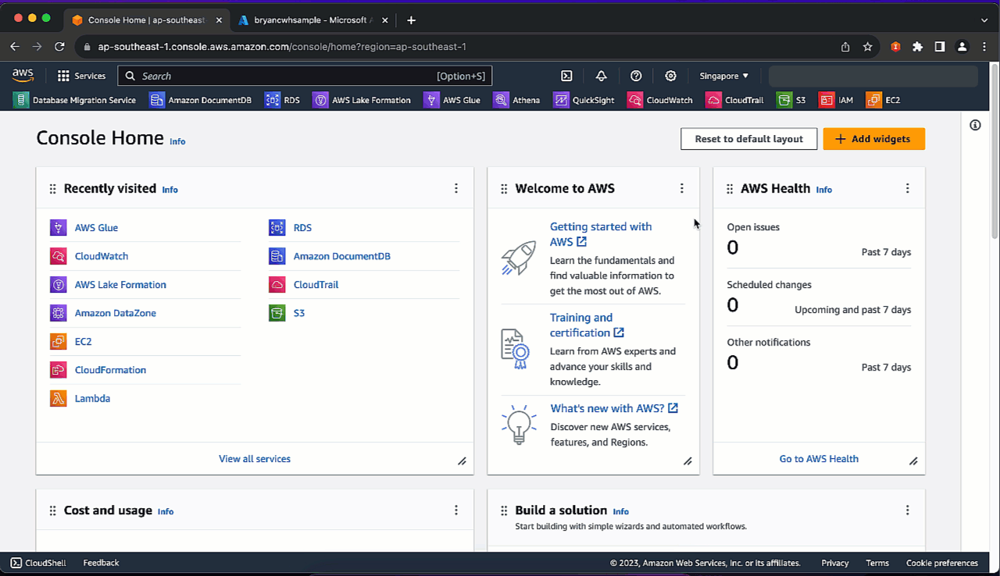 

     <i>Selecting AWS Glue from AWS Console</i>

Within AWS Glue, we have a number of pre-configured connections. For transactional databases, AWS Glue establishes these connections over JDBC. 

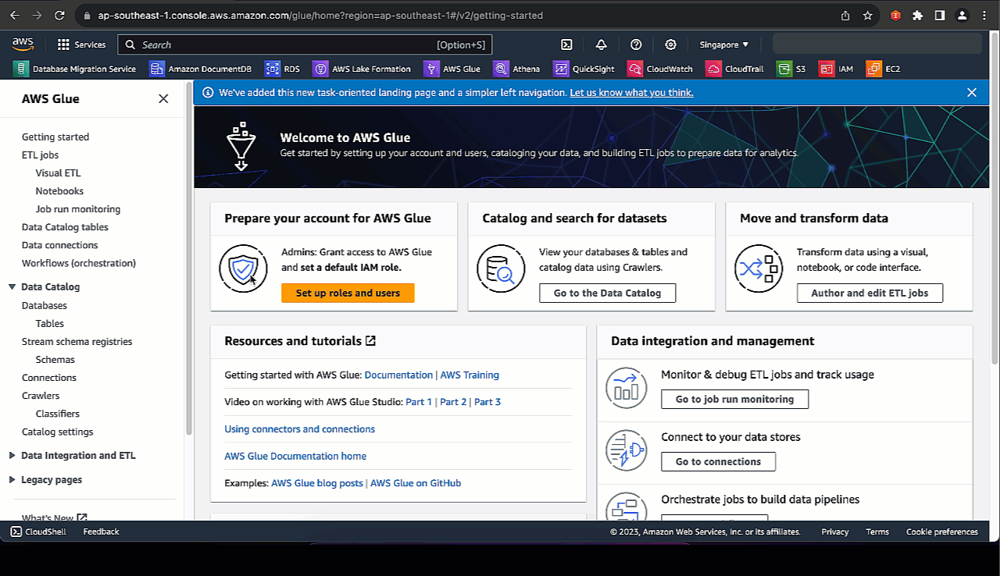 

     <i>AWS Glue connections</i>

Opening up the connector named "AzureSQL", we can dive deeper into the connection details. Here you can see that we have preconfigured the necessary details to initiate a JDBC connection to our Azure SQL Server such as the JDBC connection URL and other details.

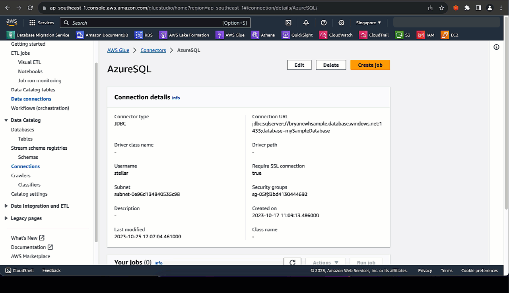 

     <i>Connection details including JDBC Connection URL</i>

These details matches that over at our Azure SQL Server. 

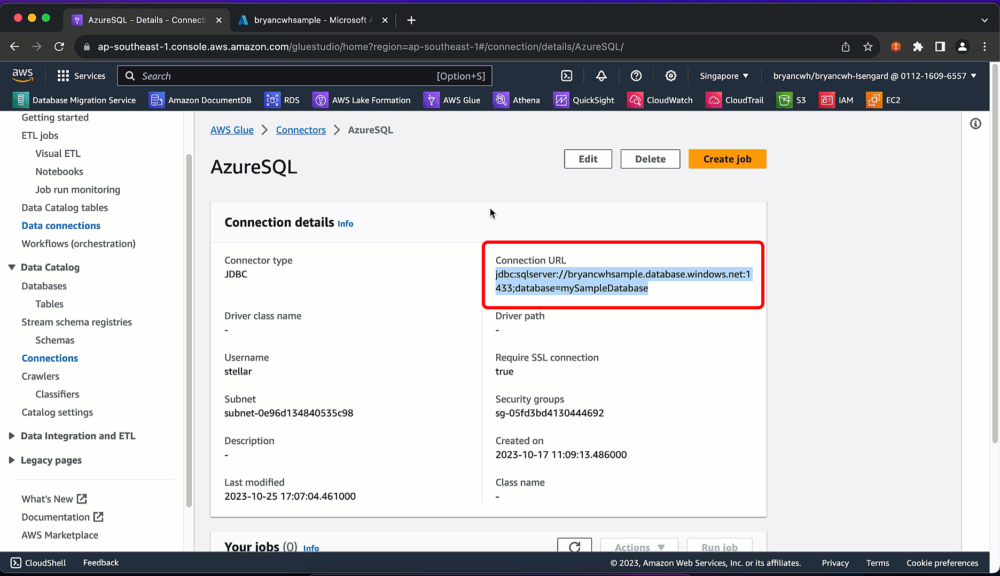 

     <i>Azure SQL server name</i>

With the preconfigured connections, we can configure a crawler that executes the crawling activity. 

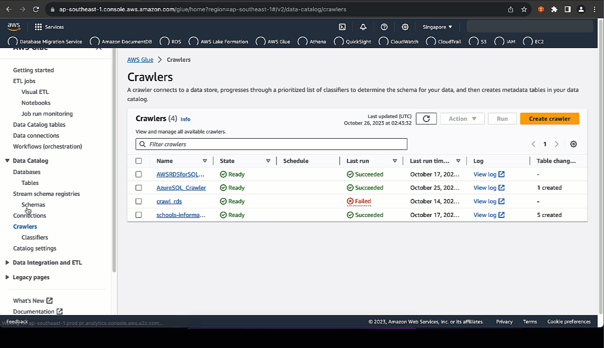 

     <i>AWS Glue Crawler</i>

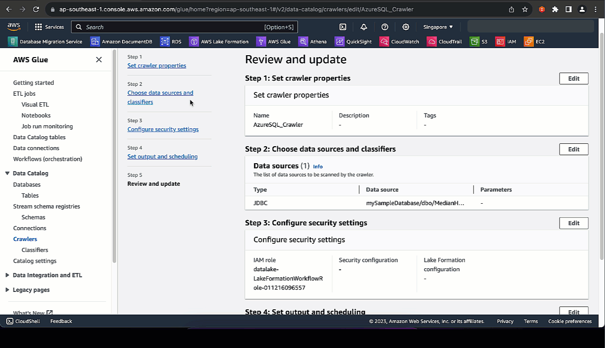 

     <i>Configuring crawling source</i>

Also within the crawler settings, you can choose to output the crawled metadata directly into AWS DataZone.

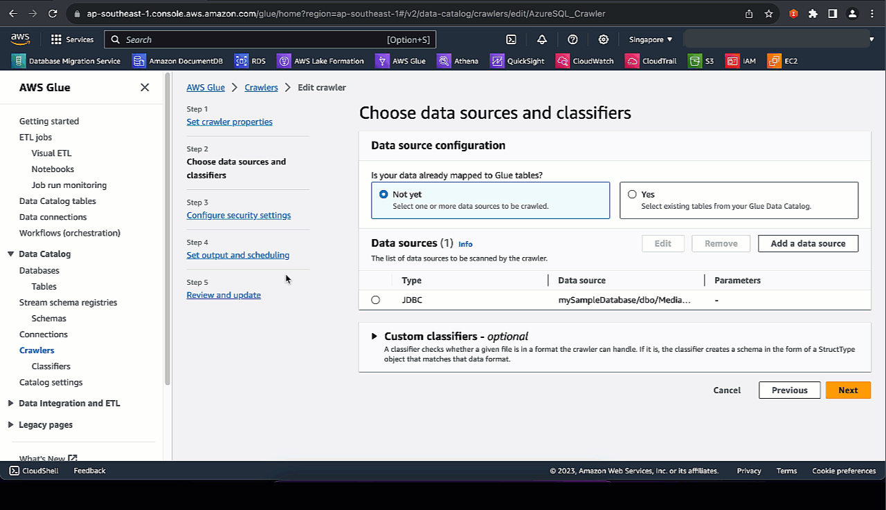 

     <i>Output crawled metadata to AWS DataZone database</i>

We initiate the crawling activity. This may take some time to complete especially if this is the first time we are crawling this source. Alternatively, we can also schedule the crawler to activate on a recurring basis.

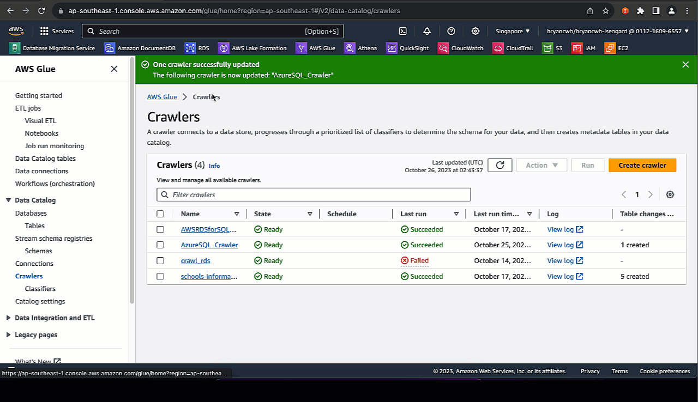 

     <i>Initiating Crawler activity</i>

Now that our crawling activity is complete, let's take a look at the most recent crawl job. You can also see previous runs of the crawler.
