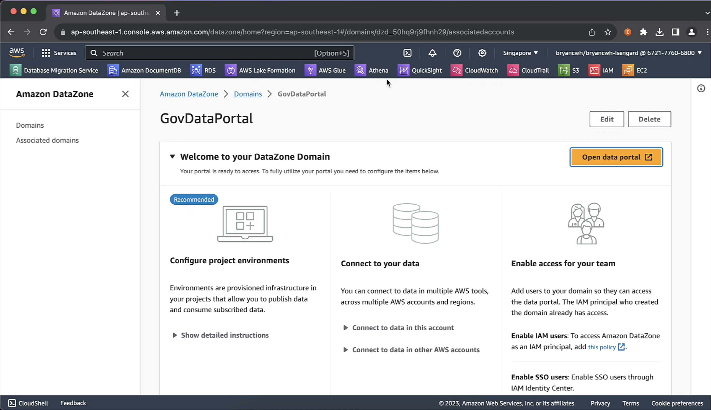

# datazone-demos
## Background
We built a mini demo environment for AWS Datazone for the SNDGO Data Infrastructure Workshop conducted on 1st Nov 2023.

## Setup

## Demo 

### Use Case #1 - Single Sign On using Azure AD Federation

### Use Case #2 - Data Publication and Consumption workflow - AWS

### Use Case #3 - Data Publication and Consumption workflow - Non AWS

#### Part 1 - Crawling Metadata from Azure SQL Server

[Full Demo](https://dwei4f633mwy3.cloudfront.net/datazone-demo-part-4-1.mp4)

In this section, we will demonstrate how to ingest metadata into AWS Data Zone from non-AWS sources. We are going to make use of AWS Glue to crawl a database within Azure SQL Server itself. 

 

     <i>Selecting AWS Glue from AWS Console</i>

Within AWS Glue, we have a number of pre-configured connections. For transactional databases, AWS Glue establishes these connections over JDBC. 

 

     <i>AWS Glue connections</i>

Opening up the connector named "AzureSQL", we can dive deeper into the connection details. Here you can see that we have preconfigured the necessary details to initiate a JDBC connection to our Azure SQL Server such as the JDBC connection URL and other details.

 

     <i>Connection details including JDBC Connection URL</i>

These details matches that over at our Azure SQL Server. 

 

     <i>Azure SQL server name</i>

With the preconfigured connections, we can configure a crawler that executes the crawling activity. 

 

     <i>AWS Glue Crawler</i>

 

     <i>Configuring crawling source</i>

Also within the crawler settings, you can choose to output the crawled metadata directly into AWS DataZone.

 

     <i>Output crawled metadata to AWS DataZone database</i>

We initiate the crawling activity. This may take some time to complete especially if this is the first time we are crawling this source. Alternatively, we can also schedule the crawler to activate on a recurring basis.

 

     <i>Initiating Crawler activity</i>

Now that our crawling activity is complete, let's take a look at the most recent crawl job. You can also see previous runs of the crawler.

#### Part 2 - Publishing data into AWS DataZone

[Full Demo](https://dwei4f633mwy3.cloudfront.net/datazone-demo-part-4-2.mp4)

Now that our crawl activity is complete, we head back into the data portal. From there we will do some level of preparation work before publishing this into AWS DataZone for wider use.

From within the **Household Income** project, we see there is one present data source which is pointing to glue crawler we configured earlier. The crawled data appears under **Inventory Data**. From here there are several things we will do: 

1. Inspecting the data schema
2. Tagging schema with glossary terms
3. Add business metadata

**Inspecting the data schema**

One of the first few things we like to do as data publisher is to ensure that the data crawled from Glue is correct. From within **Inventory Data**, choose the dataset item we just imported, and check out the **Schema** tab. Here you will see a list of the different columns that has been automatically crawled from the Azure SQL Server data source.

It is usually time consuming to edit and modify any incorrect column names, especially when we are crawling data from transactional systems. Within AWS DataZone, we make use of ML inference to infer the full column names from source itself. Sometimes this may come in the form of short forms or abbreviations. In our example, the raw column name extracted from Azure SQL Server is *gini coeff equiv hh income aft tax (mos)*. This is being automatically inferred to *Gini Coefficient For Equivalent Household Income After Tax*. 

All inferred column names have this icon <insert>. You will be asked to accept or reject the inferred column names. 

 

     <i>Inspecing the data schema</i>

To standardise data intepretation and formats across your organisation, it is often advantageous to define a data glossary of your organisational definition of certain data terms. Within AWS DataZone you can tag each column with a predefined glossary term. 

In the example, let's say the term *gini coeff* is well-defined in your organisation and you would like to ensure that the understanding of this term is unified. You can tag this column with the *gini coeff* tag. Once tagged you can double confirm the definition by mouse over. 

 

     <i>Tagging with organisational glossary term</i>

**Adding Business Metadata**

We add business metadata to an existing inventory data using **Metadata Forms**. In this case let's provide a data SLA level to inform users of the frequency we intend to update this dataset.

 

     <i>Adding business metadata</i>

