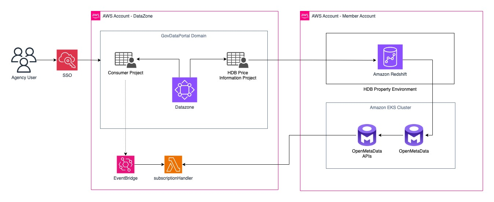
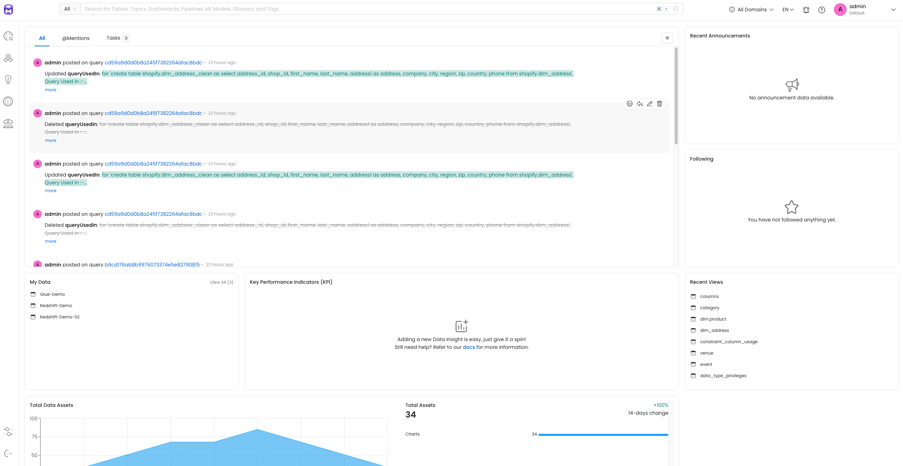
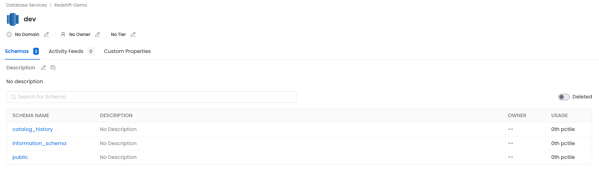
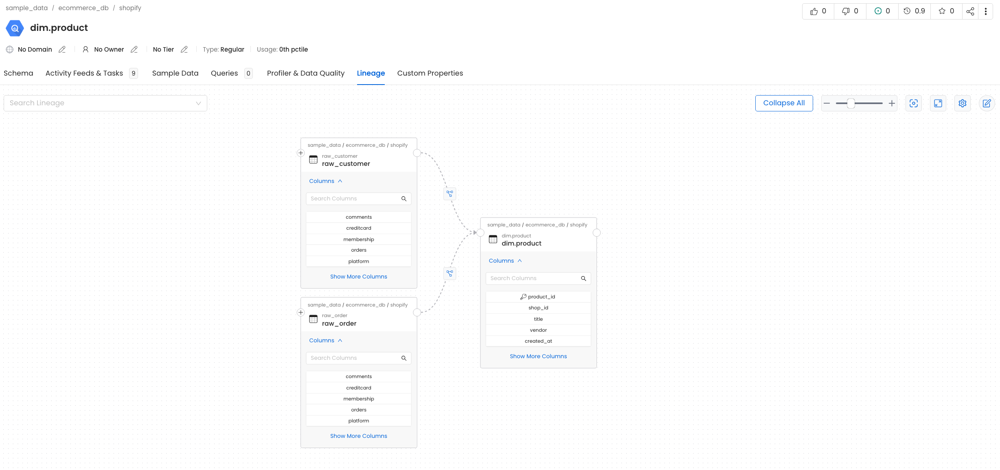
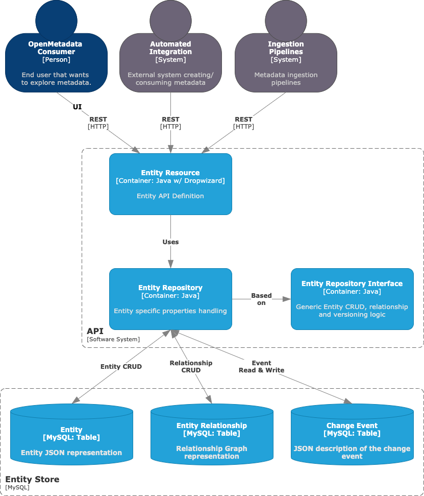

# gda2

## OpenMetadata Exploration

### Background

We are trying to see if we could use some of these open source products to compensate for short comings in AWS Data Zone and AWS Glue.
There are two layers we think this could be possible:
1. [Data Lineage](https://docs.open-metadata.org/v1.2.x/how-to-guides/openmetadata/data-lineage)
2. [Data Quality](https://docs.open-metadata.org/v1.2.x/how-to-guides/openmetadata/data-quality-profiler)

OpenMetadata has the ability to generate lineage information from various inputs it ingests. These includes Metadata ingestion, pipeline ingestion and direct lineage ingestion. OpenMetadata then make sense of all the lineage information from different sources and incorporate them into a coherent lineage diagram.

### OpenMetadata and AWS Testing
In this section, we test how OpenMetadata can be integrated with the AWS Data Analytics stack. In particular, we explored how data lineage information can be ingested and extracted from the OpenMetadata platform. For this use case, our data producer has already gathered metadata information from its Redshift data source, and published this data to AWS DataZone for sharing using the DataZone built-in DefaultDataWarehouse blueprint. We also have an OpenMetadata instance launched within an Amazon EKS Cluster that extracts and ingests data lineage information from our Redshift Cluster.

This is the high-level architecture of our demo setup involving multiple AWS accounts as well as an OpenMetadata instance hosted within an EKS Cluster. 



#### Setup
To get started with OpenMetadata, follow this [quickstart](https://docs.open-metadata.org/v1.2.x/quick-start/local-docker-deployment) to launch a OpenMetadata standalone instance on your local machine or within an Amazon EKS Cluster.



OpenMetadata can extract metadata from a variety of datasources via its list of [connectors](https://docs.open-metadata.org/v1.2.x/connectors). For this demo, we use the Redshift connector to ingest our Redshift cluster's metadata into OpenMetadata. Follow this [guide](https://docs.open-metadata.org/v1.2.x/connectors/database/redshift) to deploy the Redshift connector. 



#### Lineage

TBD



#### API Configuration 

OpenMetadata has the following APIs. See this [API documentation](https://docs.open-metadata.org/swagger.html) for full details API endpoints.

Sample REST API to query lineage data for product table 

```
GET http://localhost:8585/api/v1/lineage/table/name/sample_data.ecommerce_db.shopify.%22dim.product%22
```

Response sample

<h6>

```
200 OK

{
    "entity": {
        "id": {id},
        "type": "table",
        "name": "dim.product",
        "fullyQualifiedName": "sample_data.ecommerce_db.shopify.\"dim.product\"",
        "description": "This dimension table contains information about each of the products in your store. This table ...",
        "deleted": false,
        "href": "http://localhost:8585/api/v1/tables/{id}"
    },
    "nodes": [
        {
            "id": {id},
            "type": "table",
            "name": "raw_customer",
            "fullyQualifiedName": "sample_data.ecommerce_db.shopify.raw_customer",
            "description": "This is a raw customers table as represented in our online DB. This contains ...",
            "deleted": false,
            "href": "http://localhost:8585/api/v1/tables/{id}"
        },
        {
            "id": {id},
            "type": "table",
            "name": "raw_order",
            "fullyQualifiedName": "sample_data.ecommerce_db.shopify.raw_order",
            "description": "This is a raw orders table as represented in our online DB. This table contains ...",
            "deleted": false,
            "href": "http://localhost:8585/api/v1/tables/{id}"
        }
    ],
    "upstreamEdges": [
        {
            "fromEntity": {id},
            "toEntity": {id},
            "lineageDetails": {
                "sqlQuery": "insert into sample_data.ecommerce_db.shopify.\"dim.product\" as select * from sample_data.ecommerce_db.shopify.raw_customer",
                "columnsLineage": [],
                "pipeline": {
                    "id": {id},
                    "type": "pipeline",
                    "name": "dim_product_etl",
                    "fullyQualifiedName": "sample_airflow.dim_product_etl",
                    "description": "diim_product ETL pipeline",
                    "displayName": "dim_product etl",
                    "deleted": false
                },
                "source": "Manual"
            }
        },
        {
            "fromEntity": {id},
            "toEntity": {id},
            "lineageDetails": {
                "sqlQuery": "select * from sample_data.ecommerce_db.shopify.raw_order",
                "columnsLineage": [],
                "pipeline": {
                    "id": {id},
                    "type": "pipeline",
                    "name": "dim_product_etl",
                    "fullyQualifiedName": "sample_airflow.dim_product_etl",
                    "description": "diim_product ETL pipeline",
                    "displayName": "dim_product etl",
                    "deleted": false
                },
                "source": "Manual"
            }
        }
    ],
    "downstreamEdges": []
}

```

## Resources

### OpenMetadata High Level Design

Base on the [HLD](https://docs.open-metadata.org/v1.2.x/main-concepts/high-level-design), there are several areas we can target. 
hld is illustrated below:


We need to focus on the **API container** layer.



Apparently the API layer uses dropwizard as API server and are designed to respond to calls for CRUD operations. We should see how we can use these API as CRUD layer, and extract data. Only worry is the security piece.

### OpenMetadata APIs
OpenMetadata api schema definition can be found [here](https://docs.open-metadata.org/v1.2.x/main-concepts/metadata-standard/apis).